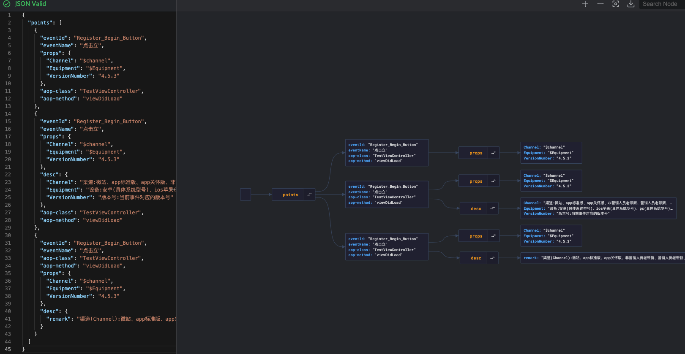
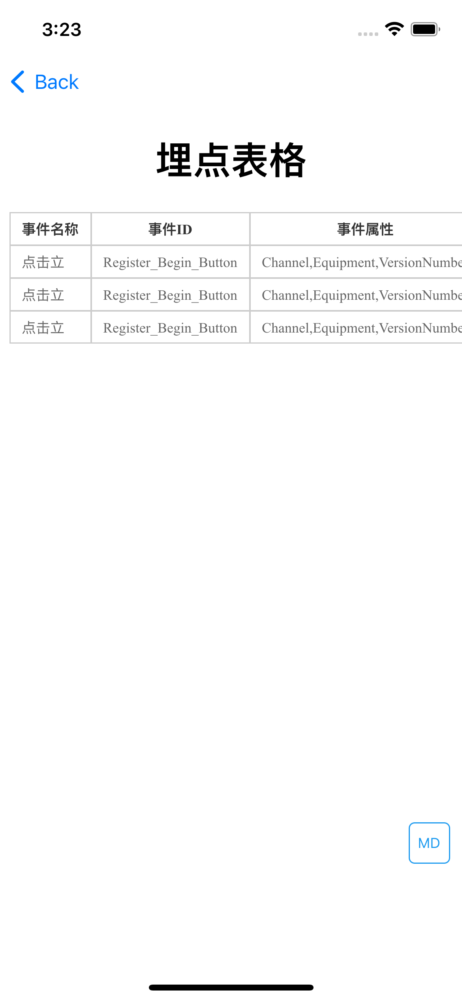

# CLAspects

统一管理埋点，使用JSON格式对项目进行埋点处理，支持动态属性。

```
@implementation AppDelegate

- (BOOL)application:(UIApplication *)application didFinishLaunchingWithOptions:(NSDictionary *)launchOptions {
    ViewController *viewController = [[ViewController alloc]init];
    UINavigationController *root = [[UINavigationController alloc]initWithRootViewController:viewController];
    self.window = [[UIWindow alloc] initWithFrame:[[UIScreen mainScreen] bounds]];
    self.window.backgroundColor = [UIColor whiteColor];
    [self.window setRootViewController:root];
    [self.window makeKeyAndVisible];
    
    [NSTimer scheduledTimerWithTimeInterval:0.1 repeats:NO block:^(NSTimer * _Nonnull timer) {
        [self md];
    }];
    return YES;
}

- (void)md {
    CLAConfigOptions *options = [[CLAConfigOptions alloc]init];
    options.debug = YES;
    [[CLAspects sharedInstance]aop:options block:^(NSDictionary *result) {
        NSLog(@"result = %@",result);
    } configBlock:^(NSString *html) {
        NSLog(@"config = %@",html);
    }];
}
```

- 使用jsonscrack查看数据 [jsoncrack.com](https://github.com/AykutSarac/jsoncrack.com)



- debug模式，网页查看埋点表格


